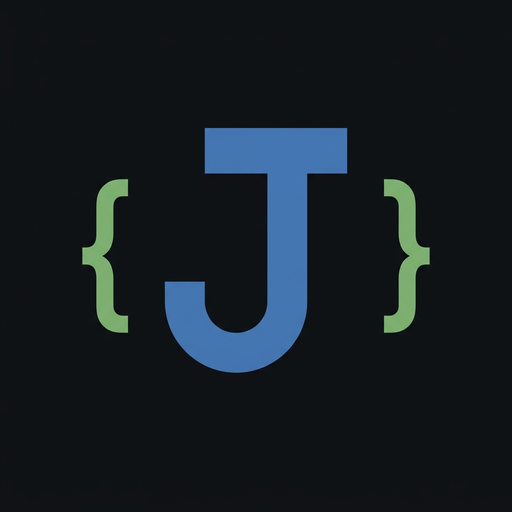

# 🌐 JSON Translator

<p align="center">
  
</p>

<p align="center">
  <strong>A modern, high-performance desktop translation workbench & QA editor for JSON localization files.</strong>
</p>

<p align="center">
  
  
  
  
  
</p>

---

## 🚀 Overview

**JSON Translator** is a professional desktop application designed for localization engineers, developers, and translators. It simplifies translating, updating, validating, and managing large key-value JSON localization files with machine translation integrations, automated variable protection, smart diff & merge sync, and terminology consistency checks.

---

## ✨ Key Features

### 🗂️ 1. Master-Detail Workspace
- **Fast 50-Item Pagination**: Smoothly handles tens of thousands of JSON entries without DOM lag.
- **Smart Status Badges**: Visual indicator dots for translated, untranslated, warning, and error states.
- **Instant Search & Filters**: Filter by *All*, *Untranslated*, *Translated*, *Errors*, or *Warnings*, coupled with instant real-time text search.
- **Resizable Panels**: Smooth column and row splitters with user-preference persistence.

### 🔀 2. 3-Stage Smart Diff & Sync (Merge Update)
- Seamlessly synchronize new-version JSON files into your current translation project without losing existing work:
  1. **Exact Key Matching**: Retains all existing translations.
  2. **Renamed Key Recovery**: Automatically matches translations whose keys changed but source values remained identical.
  3. **Fuzzy Match (≥80% Similarity)**: Detects minor source string updates (using Sørensen–Dice bigram similarity) and transfers translations as drafts.
  4. **Brand New & Removed Trackers**: Clearly outlines newly added and obsolete keys.

### ⚡ 3. Multi-Engine Machine Translation & Batch MT
- **Google Translate & DeepL API**: Translate single strings or batch translate entire scopes (active page, untranslated, or full project).
- **Placeholder & Tag Masking**: Protects `%s`, `%d`, `%user`, `<b>`, `<br/>`, etc., from being mangled or translated by machine translation engines.
- **CORS-Free Backend Routing**: API requests run securely through the Node.js Electron main process.

### 🛡️ 4. Real-time QA & Syntax Validation
- **Placeholder Parity Check**: Validates that all variables match the exact order and names of the source string.
- **HTML/XML Tag Frequency Validation**: Multi-set balance checks for missing or extra formatting tags.
- **Glossary Consistency QA**: Warns if a defined glossary term is missing in the target translation.
- **Length Overrun Warning**: Alerts translators when target strings drastically exceed source length.

### 📖 5. Interactive Glossary & Smart Case Matching
- **Terminology Store**: Manage terms with source, translation, and optional context notes.
- **Smart Case Adaptation**: Automatically adapts glossary terms based on source text casing (`UPPERCASE`, `TitleCase`, `lowercase`).
- **Interactive Source Highlighting & Selection Tooltip**: Click any highlighted term in the source panel or select text to add it directly to your dictionary.
- **Universal Import & Export**: Full support for JSON and CSV/TSV (Excel-compatible with UTF-8 BOM).

### 🔍 6. Global Find & Replace
- Project-wide search and replace with support for:
  - **Match Case (`Aa`)**
  - **Whole Word (`\b`)**
  - **Regular Expressions (`RegEx`)**
- Live match counter and preview list with instant jump-to-entry navigation.

### 📊 7. Project Statistics & Analytics
- Comprehensive breakdown of source words, remaining words, target words generated, character counts (with/without spaces), and project completion rate.

### 🌐 8. Extensible Multi-Language UI (i18n)
- Switch seamlessly between English and Turkish (or any newly added language).
- **Zero-Config Addition**: Add any `src/languages/<code_name>.json` file to automatically register new interface languages at build time.

---

## ⌨️ Keyboard Shortcuts

| Shortcut | Action |
| :--- | :--- |
| <kbd>Ctrl</kbd> + <kbd>S</kbd> | Save current project |
| <kbd>Ctrl</kbd> + <kbd>Shift</kbd> + <kbd>S</kbd> | Save As new file |
| <kbd>Ctrl</kbd> + <kbd>Enter</kbd> | Save current entry and jump to next |
| <kbd>Ctrl</kbd> + <kbd>T</kbd> | Auto-translate current entry |
| <kbd>Ctrl</kbd> + <kbd>H</kbd> | Open Global Find & Replace |
| <kbd>Alt</kbd> + <kbd>↑</kbd> / <kbd>↓</kbd> | Navigate to previous / next entry |
| <kbd>Esc</kbd> | Close active modal / dictionary sidebar |

---

## 🛠️ Tech Stack & Architecture

- **Core**: TypeScript (Strict Mode)
- **GUI Engine**: [Electron 31](https://www.electronjs.org/)
- **Bundler & Dev Server**: [Vite 5](https://vitejs.dev/)
- **Architecture Pattern**:
  - `BaseModal` Abstract Template Pattern
  - `ITranslationProvider` Strategy Pattern for MT Engines (OCP compliant)
  - `ElectronBridge` IPC Decoupling Layer
  - Independent Modular Stores (`TranslationStore`, `DictionaryStore`, `RecentFilesStore`)

---

## 📦 Getting Started

### Prerequisites
- [Node.js](https://nodejs.org/) (v18.0.0 or higher recommended)
- `npm` (v9.0.0 or higher)

### Installation

1. Clone the repository:
   ```bash
   git clone https://github.com/your-username/json-translator.git
   cd json-translator
   ```

2. Install dependencies:
   ```bash
   npm install
   ```

3. Run in development mode (Electron + Vite HMR):
   ```bash
   npm run electron:dev
   ```

---

## 🏗️ Building & Packaging

To compile TypeScript, build the web assets with Vite, and bundle native desktop executables via `electron-builder`:

```bash
# Build for current OS
npm run electron:build
```

### Supported Outputs:
- **Windows**: Portable executable (`release/JsonTranslator-win-portable.exe`)
- **Linux**: AppImage bundle (`release/JsonTranslator-*.AppImage`)

---

## 📁 Project Structure

```text
├── assets/                  # Application icons & branding assets
├── electron/                # Electron Main & Preload process scripts
│   ├── ipc-handlers.ts      # Native file dialogs, FS access & MT proxies
│   ├── main.ts              # Electron browser window lifecycle
│   └── preload.ts           # Secure ContextBridge IPC API
├── src/                     # Renderer (Web Application) source
│   ├── bridge/              # IPC bridge abstraction layer
│   ├── core/                # Core logic (JsonMerger, Parser, Validator, Stats)
│   ├── i18n/                # Language manager and translation helpers
│   ├── languages/           # UI translation dictionaries (en.json, tr.json, ...)
│   ├── services/            # Machine translation providers (Google, DeepL)
│   ├── store/               # State management (Translation, Dictionary, Recent)
│   ├── ui/                  # UI components, modals, and controllers
│   ├── App.ts               # Main application coordinator
│   ├── main.ts              # Application bootstrap
│   └── style.css            # Custom responsive dark-theme styles
├── tools/                   # Translation utilities and conversion scripts
├── index.html               # Main HTML entry point
├── package.json             # Scripts, dependencies, and electron-builder config
├── tsconfig.json            # TypeScript project references
├── tsconfig.electron.json   # TypeScript config for Electron Main
├── tsconfig.renderer.json   # TypeScript config for Vite Renderer
└── vite.config.ts           # Vite bundler configuration
```

---

## 🤝 Contributing

Contributions are warmly welcome! Please feel free to submit issues, feature requests, or Pull Requests.

1. Fork the Project
2. Create your Feature Branch (`git checkout -b feature/AmazingFeature`)
3. Commit your Changes (`git commit -m 'feat: add amazing feature'`)
4. Push to the Branch (`git push origin feature/AmazingFeature`)
5. Open a Pull Request

---

## 📄 License

This project is licensed under the MIT License - see the [LICENSE](LICENSE) file for details.
